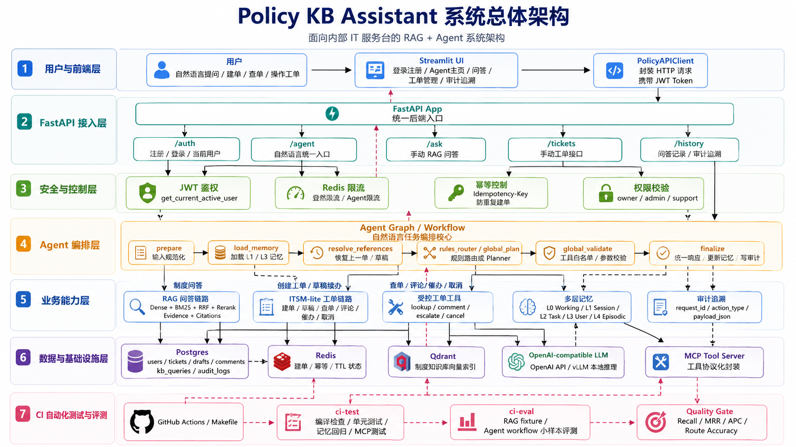
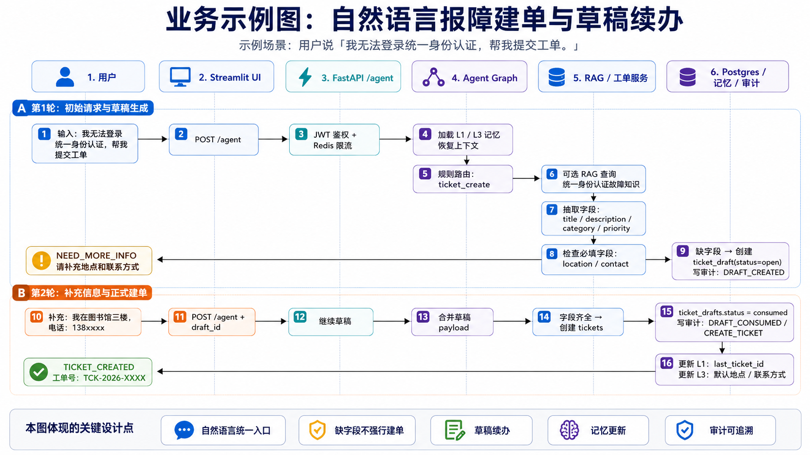
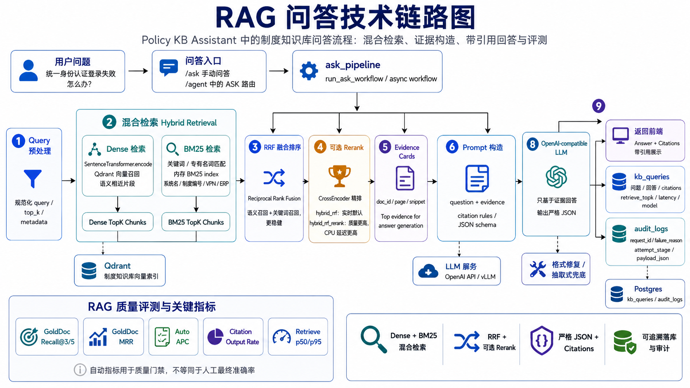

# Policy KB Assistant

面向企业内部 IT 服务台场景的 RAG + Agent 工单助手。项目支持自然语言制度问答、ITSM-lite 工单创建与操作、多轮上下文记忆、审计追溯和轻量 CI 评测，覆盖从用户输入到工具执行、结果返回和质量门禁的完整链路。

> 适合展示的关键词：RAG、AI Agent、LangGraph、FastAPI、Qdrant、BM25、RRF、Rerank、Tool Calling、MCP、Docker Compose、CI 自动化评测。

## 项目亮点

- **完整业务链路**：`用户输入 -> 登录鉴权/限流 -> Agent 路由 -> RAG 问答/工单工具 -> 记忆更新 -> 审计追溯 -> CI 评测`。
- **混合检索优化**：实现 Dense 向量检索 + BM25 关键词检索 + RRF 融合排序，并支持 CrossEncoder rerank 高质量模式。
- **受约束 Agent 执行**：模型只负责生成路由或工具计划，后端统一做 schema 校验、权限校验、工具白名单、高风险二次确认和审计落库。
- **ITSM-lite 工单能力**：支持一句话建单、缺字段草稿续办、查单、追加评论、催办、取消确认。
- **多层记忆设计**：实现 L0-L4 记忆边界，支持“继续刚才的工单”“上一单”等多轮对话引用恢复。
- **工程化交付**：Docker Compose 一键拉起 API、UI、Postgres、Redis、Qdrant、MCP 与 KB 初始化任务，并接入 GitHub Actions 质量门禁。

## 架构图



系统由 Streamlit UI、FastAPI API、LangGraph Agent、RAG 检索生成链路、工单服务层、PostgreSQL、Redis、Qdrant 和 MCP 服务组成。前端请求进入后端后，会先经过登录态校验和限流，再由 Agent 判断进入问答、建单、草稿续办或工单工具路径。

## 业务示例



典型用户路径包括：

- **制度问答**：用户提问企业内部制度，系统检索知识库片段，生成带引用出处的回答。
- **一句话建单**：用户描述故障，Agent 抽取标题、描述、类别、优先级、地点、联系方式等字段，字段完整则创建工单，字段缺失则生成草稿等待补充。
- **工单工具操作**：用户自然语言查单、追加说明、催办或取消工单；取消等高风险动作需要 `confirm_token` 二次确认。

## RAG 问答链路



RAG 链路分为召回、融合、重排序和生成四步：

1. **Dense 检索**：使用 BGE embedding 从 Qdrant 召回语义相关片段。
2. **BM25 检索**：基于文档 payload 构建关键词索引，补充企业内部专有名词、编号、系统名等精确匹配能力。
3. **RRF 融合**：将向量召回和关键词召回结果按 Reciprocal Rank Fusion 融合排序，兼顾语义泛化和关键词命中。
4. **CrossEncoder Rerank**：高质量模式下使用 `BAAI/bge-reranker-base` 对候选片段精排。
5. **答案生成**：基于 TopK 证据生成结构化 JSON，包含答案、引用、证据和兜底拒答逻辑。

## 量化效果

完整 RAG 评测使用 `130` 条制度问答样例，对比纯 Dense、Hybrid RRF 和 Hybrid RRF + Rerank 三种模式。

| 模式 | GoldDoc R@3 | GoldDoc R@5 | GoldDoc MRR | Auto APC | Citation Output | Refusal | Retrieve p50 |
| --- | ---: | ---: | ---: | ---: | ---: | ---: | ---: |
| Dense | 86.15% | 90.00% | 0.7955 | 40.63% | 86.15% | 14.62% | 211 ms |
| Hybrid RRF | 93.08% | 96.15% | 0.8574 | 43.31% | 88.46% | 13.08% | 216 ms |
| Hybrid RRF + Rerank | 96.92% | 97.69% | 0.9164 | 47.64% | 93.08% | 6.92% | 11192 ms |

结论：

- 默认实时模式采用 **Hybrid RRF**，在 p50 检索延迟仅增加约 `5 ms` 的情况下，将 GoldDoc R@5 从 `90.00%` 提升到 `96.15%`。
- 高质量模式采用 **Hybrid RRF + Rerank**，GoldDoc R@5 达到 `97.69%`，GoldDoc MRR 达到 `0.9164`，但 CPU 环境下 CrossEncoder rerank 延迟较高，更适合作为离线评测或高质量模式。
- 指标口径：GoldDoc R@K/MRR 是文档级命中指标，不等同于严格证据条款命中；Auto APC 是自动答案要点覆盖率，不等同于人工最终正确率；Citation Output 是引用输出率，不代表引用一定完全正确。

轻量 CI 质量门禁：

- 核心确定性测试：`10 passed`
- Agent 工作流评测：`12` 条样例，Route Accuracy `91.7%`，工具执行 Error Count `0`
- RAG fixture：GoldDoc R@3/R@5 `0.750`，GoldDoc MRR `0.625`，Citation Output Rate `0.750`

## 核心功能

### 1. Agent 意图路由

- 基于 LangGraph 编排 Agent 主流程。
- 规则路由覆盖建单、补充信息、确认操作、查单等高频固定场景。
- 长尾或模糊表达可由 LLM Planner 生成执行计划。
- Planner 输出不会直接执行，必须经过 Pydantic schema、工具白名单、权限与风险校验。

### 2. 制度知识库问答

- 支持自然语言问题输入。
- 支持 Dense + BM25 + RRF 混合检索。
- 支持 CrossEncoder rerank 精排。
- 输出带 citations 的结构化答案。
- 问答记录写入 `kb_queries`，并通过 `request_id` 关联审计日志。

### 3. ITSM-lite 工单管理

- 支持自然语言创建工单。
- 支持缺必填字段时生成草稿，等待用户补充后转正。
- 支持查单、追加评论、催办、取消。
- 支持 `Idempotency-Key`，避免重复提交。
- 高风险取消操作需要 `confirm_token` 二次确认。

### 4. 分层记忆

| 层级 | 名称 | 作用 |
| --- | --- | --- |
| L0 | Working Memory | 单次请求内保存 route、intent、抽取字段、工具结果、confirm_token 等临时状态 |
| L1 | Session Memory | 保存当前会话目标、最近轮次、会话摘要和未完成任务 |
| L2 | Task Memory | 保存工单草稿、待确认动作、任务进度等可恢复状态 |
| L3 | User Memory | 保存低风险用户偏好，如默认地点、联系方式、部门等 |
| L4 | Episodic Memory | 从问答记录、工单记录和审计日志中回放历史事件 |

### 5. 审计追溯

- 问答、建单、工单操作、MCP 工具调用都会写入审计日志。
- 支持按 `request_id` 或 `ticket_id` 回查请求链路。
- 可追溯用户输入、Agent 路由、工具动作、返回结果和错误原因。

### 6. MCP 工具服务

- 将工单能力封装为受约束工具：
  - `lookup_ticket`
  - `add_ticket_comment`
  - `escalate_ticket`
  - `cancel_ticket`
- `/agent` 与 MCP tools 复用同一套服务层和工具校验逻辑。
- 支持 HTTP MCP 与 stdio MCP 两种形态。

## 技术栈

- **前端**：Streamlit、httpx
- **后端**：FastAPI、Pydantic、SQLAlchemy、Alembic
- **Agent**：LangGraph、规则路由、LLM Planner、Tool Registry
- **RAG**：Qdrant、sentence-transformers、BGE、rank-bm25、RRF、CrossEncoder Rerank
- **数据与中间件**：PostgreSQL、Redis、Qdrant
- **工程化**：Docker Compose、pytest、GitHub Actions、Makefile

## 本地启动

推荐使用 Docker Compose 启动完整环境。

1. 准备环境变量：

```bash
cp .env.example .env
```

至少填写：

```dotenv
POLICY_API_KEY=local-dev-key
OPENAI_API_KEY=YOUR_OPENAI_COMPATIBLE_KEY
```

2. 启动开发环境：

```bash
docker compose -f compose.yaml -f compose.dev.yaml up -d --build
```

或使用 Makefile：

```bash
make dev-up
```

3. 打开服务：

- UI：`http://localhost:8501`
- API Docs：`http://localhost:8080/docs`
- API Health：`http://localhost:8080/health`
- Qdrant Dashboard：`http://localhost:6333/dashboard`

4. 停止服务：

```bash
docker compose -f compose.yaml -f compose.dev.yaml down
```

## 常用命令

```bash
# 启动开发版容器
make dev-up

# 停止开发版容器
make dev-down

# 查看 API 和 UI 日志
docker compose -f compose.yaml -f compose.dev.yaml logs -f api ui

# 容器内运行核心测试
make ci-test

# 容器内运行轻量质量门禁
make ci-eval

# 一次执行测试 + 质量门禁
make ci-local
```

## 仓库结构

```text
src/api/          FastAPI 路由、鉴权、限流、服务层、数据库模型
src/agent_graph/  LangGraph Agent 主流程与工作记忆
src/kb/           文档入库、混合检索、答案生成
src/mcp_wrapper/  MCP 工具封装与执行器
src/ui/           Streamlit 前端
alembic/          数据库迁移
configs/          检索、模型和运行配置
scripts/          评测、CI、数据处理和 smoke 脚本
tests/            单元测试、服务测试、Agent/MCP 测试
assets/           架构图和业务链路图
```

## 设计边界

这是一个求职展示型 AI 应用项目，重点是 RAG、Agent 工具调用、业务工作流、记忆、审计和工程化评测闭环。当前安全模型适合 demo 和内部原型，不等同于生产级多租户权限系统；如果进入生产环境，需要进一步补充企业 SSO、细粒度 RBAC、审计留存策略、敏感信息脱敏和模型调用成本治理。
